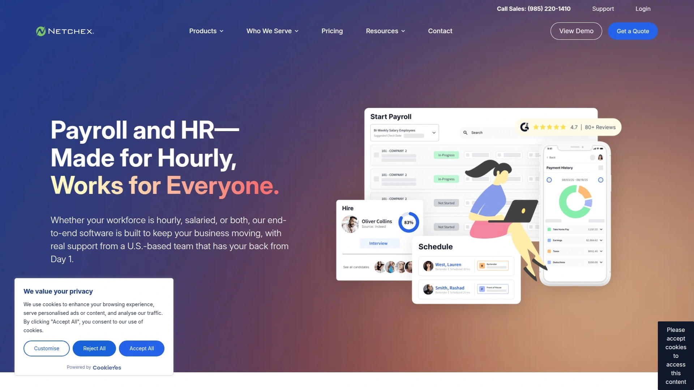
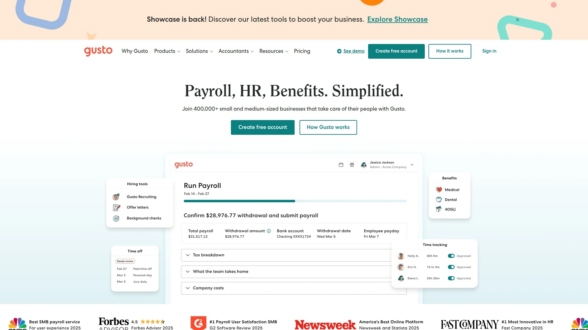
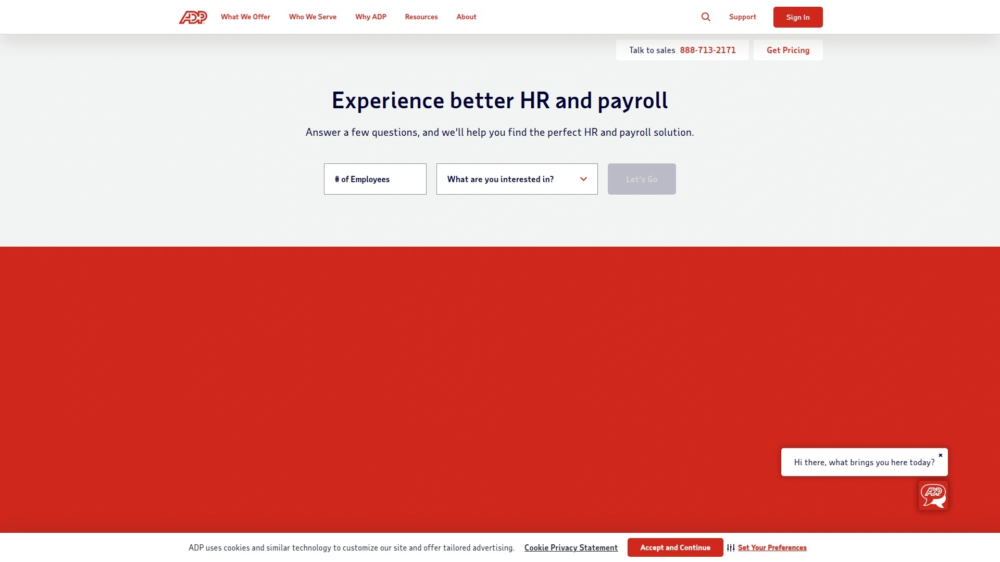
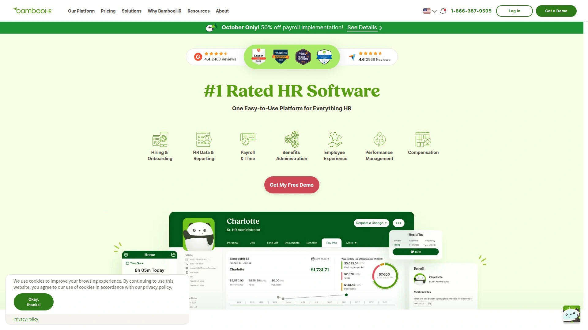
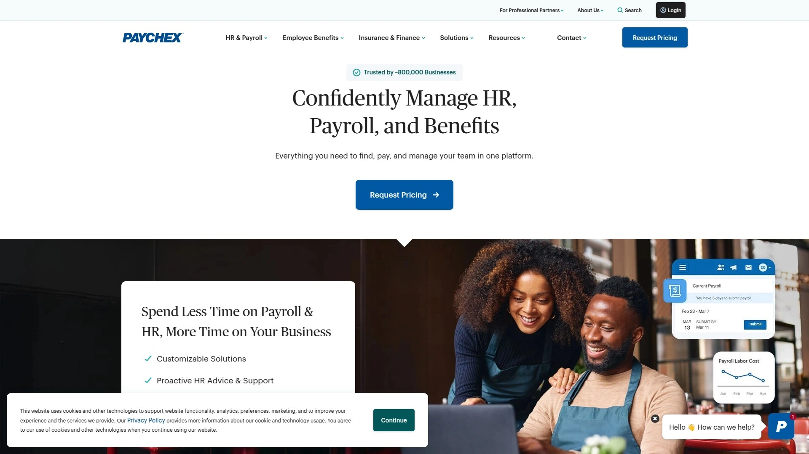
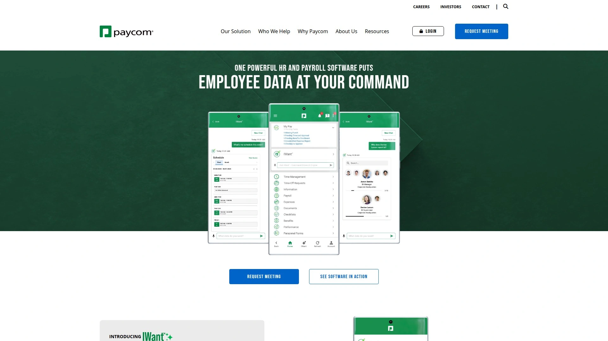
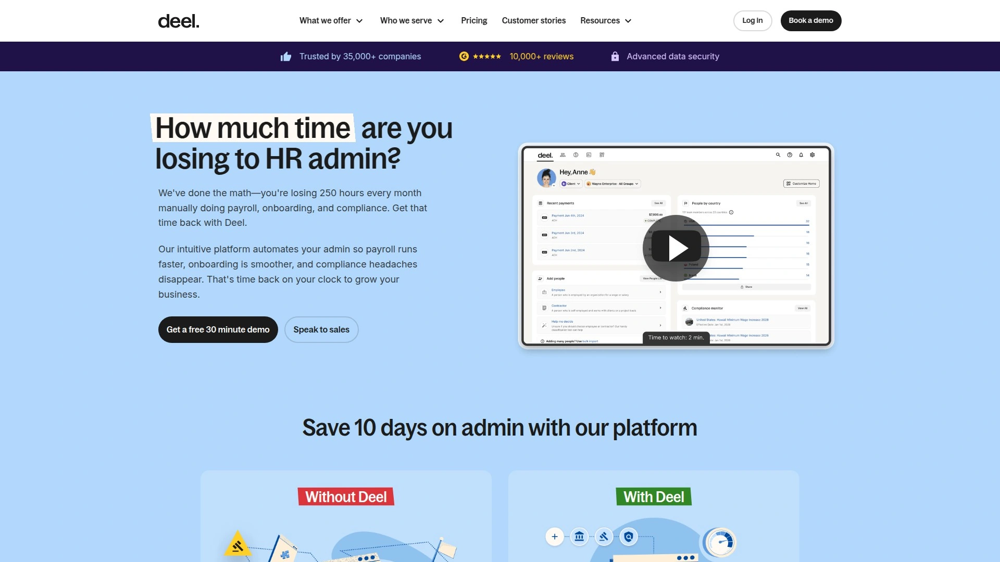
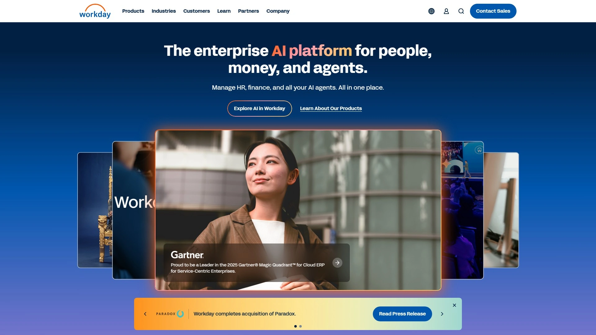
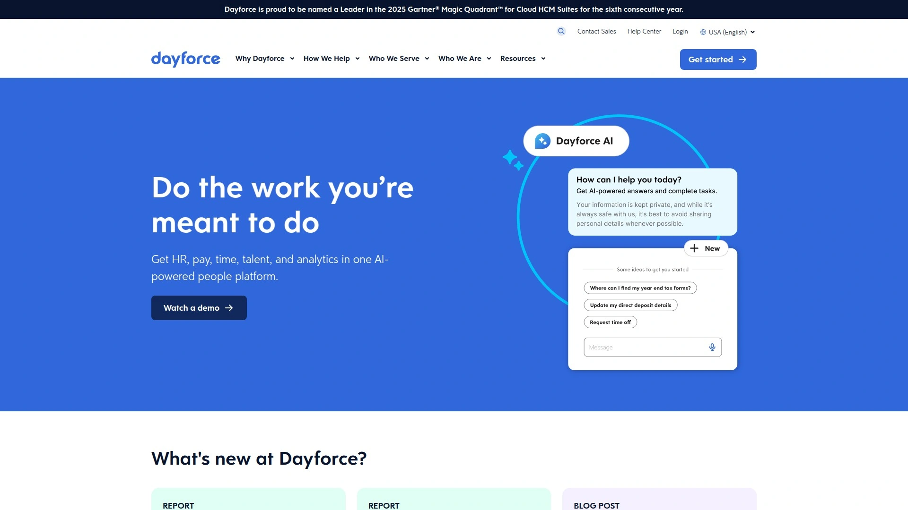
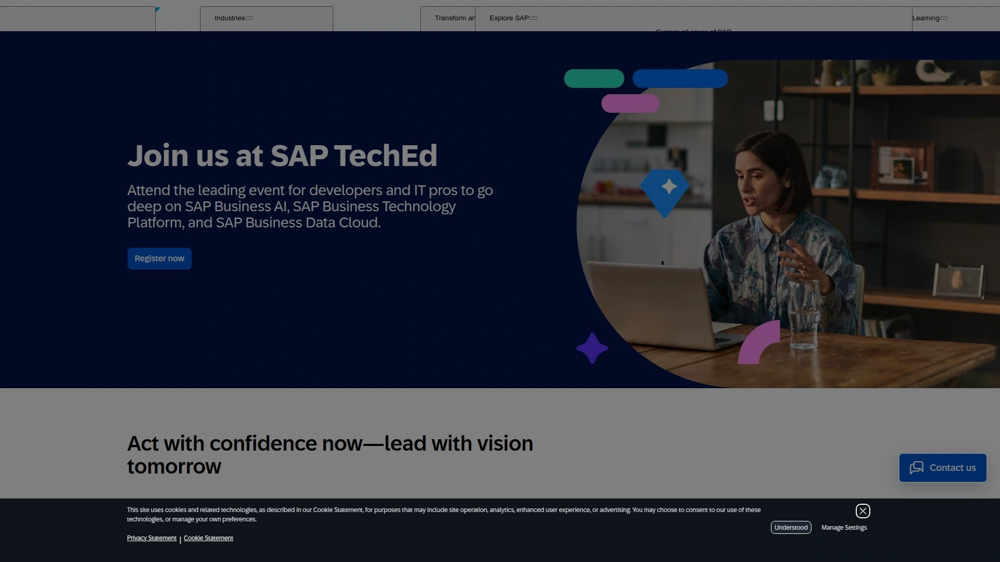

# Top 12 Best Payroll and HR Software Platforms in 2025

Running payroll and managing HR doesn't have to eat up half your week or keep you up at night worrying about compliance. The right payroll software can automate time tracking, simplify employee scheduling, handle benefits administration, and keep your workforce management running smooth—all from one place. Whether you're juggling hourly shifts or salaried teams, these platforms help you pay people accurately, stay compliant, and actually have time left over to grow your business.

## **[Netchex](https://netchex.com)**

Built specifically for hourly workforces, this platform handles everything from hiring to payroll without making you jump through hoops.

**What makes it worth your time:**

Netchex is designed for businesses that deal with complex scheduling, shift differentials, and compliance headaches. The mobile-first approach means your team can clock in with geofencing, swap shifts, and request time off without texting you at midnight. The platform saves teams up to 16 hours a week on payroll processing, even when you're managing multiple entities or seasonal workers.

**HR without the runaround:**

You get a dedicated account manager who actually knows your business—not a phone tree. Their U.S.-based support team answers 90% of calls in under a minute, and if something's really wrong, you can call a VP directly. The AskHR AI Assistant handles policy questions instantly, and the Who's In Dashboard shows you real-time attendance so you're never guessing who's actually working.

**Built-in compliance and training:**

The system automatically tracks wage and hour laws, meal breaks, and accruals without spreadsheets. You get 2,000+ compliance courses in English and Spanish, plus you can upload your own training content. Performance management tools let you run peer reviews, track goals, and document issues—all in one place.

## **[Rippling](https://www.rippling.com)**

Run payroll anywhere in the world in 90 seconds, with automated compliance and 400+ app integrations.

Rippling handles global payroll across multiple countries, automatically calculates and remits taxes based on local requirements, and gives your team a self-service mobile app for managing everything themselves. The platform integrates with over 400 apps, so you're not starting from scratch with your existing tools. Custom reporting means you can actually see the data you need to make decisions.

## **[Gusto](https://gusto.com)**

Cloud-based payroll designed for small to medium businesses that want automation without complexity.

Gusto automates payroll calculations, handles federal, state, and local tax filing, and manages benefits enrollment in one system. Employees get lifetime accounts with digital paystubs and can self-enroll in benefits without bugging HR. The platform offers unlimited payroll runs, tracks time off with multiple PTO options, and supports both hourly and salary-based computations. You can cancel payroll if you catch a mistake, and flexible schedules mean you're not locked into rigid pay periods.

## **[ADP Workforce Now](https://www.adp.com)**

Enterprise-grade HR platform that combines payroll, benefits, and talent management for businesses of all sizes.

ADP Workforce Now integrates payroll and tax filings directly in the platform, simplifies benefits enrollment, and tracks employee hours with built-in time and attendance tools. The talent management features include recruitment, performance reviews, and learning modules. You get predictive turnover insights to assess retention risk, compensation benchmarks against market trends, and automated tax calculations with pay error detection. The app marketplace lets you extend functionality with 300+ integrations.

## **[BambooHR](https://www.bamboohr.com)**

All-in-one HR platform focused on improving employee experience with easy-to-use tools for small to medium teams.

BambooHR centralizes employee records, automates new hire reporting, and handles time-off management with visual org charts and coworker directories. The Core plan starts at $10 per employee per month and includes hiring, onboarding, and benefits tracking. The Pro plan adds performance management with 360-degree feedback, customizable review cycles, and advanced reporting with 49 built-in report options. Anonymous feedback surveys and mental health check-ins help you measure employee experience beyond just productivity.

## **[Paychex Flex](https://www.paychex.com)**

Full-service payroll bundled with retirement and benefits for businesses that want everything in one package.

Paychex Flex starts around $39 per month base plus $5 per employee and scales well for teams between 10-50 people. The platform offers seamless integrations with nearly 300 apps, provides 24/7 live chat and phone support, and handles recruitment with advice for finding the right candidates. Add-ons include time tracking, retirement plan management, and benefits administration, though costs can add up with multiple features. International hiring support through G-P partnership covers 180+ countries.

## **[Paycom](https://www.paycom.com)**

Single-database workforce management system with employee self-service that eliminates data reentry.

Paycom automates workforce changes by tying workflows to positions instead of people, so promotions and transfers automatically trigger the right actions. New hires complete onboarding tasks before Day 1 with a step-by-step mobile checklist. Time tracking tools empower employees to manage their own hours with automated punch rules and missed punch requests. Scheduling automation handles shift swaps and real-time attendance without manual deployment. The platform tracks measurable ROI with visual timelines and provides real-time reporting backed by a single database.

## **[Deel](https://www.deel.com)**

Global payroll and compliance platform for hiring and paying employees in 150+ countries.

Deel supports payroll processing across 150+ countries, automatically calculates and remits taxes based on local requirements, and handles payments in multiple currencies. The employee self-service portal lets workers access pay slips and tax documents without involving HR. The platform simplifies compliance with local labor laws and reduces manual errors in international payroll. Ideal for distributed teams and companies expanding globally without setting up local entities.

## **[Workday HCM](https://www.workday.com)**

Enterprise HCM suite with AI-powered tools for workforce planning, talent management, and comprehensive analytics.

Workday offers a unified user interface that connects all HR processes in large enterprises, with embedded AI tools for workforce planning and predictive insights. The platform handles talent management with marketing tools for recruiting, role-based learning recommendations, and preset training plans for compliance and skill development. Absence planning, turnover analytics, and AI-assisted shift scheduling help managers make data-driven decisions. The system provides insights on headcount, performance, and diversity indicators with real-time data visibility.

## **[Ceridian Dayforce](https://www.dayforce.com)**

Real-time HCM platform with AI agents that automate tasks and provide labor-demand notifications.

Dayforce runs on real-time data that updates instantly for decision-making, with AI assistants that automate routine tasks and run scenarios. The platform sends labor-demand notifications if there's risk of over- or understaffing. Features include automated payroll, benefits administration, talent management, and time tracking—all in one global system. Best suited for large enterprises that need comprehensive tools, though it requires internal IT personnel or consultants to configure and maintain.

## **[Oracle Fusion Cloud HCM](https://www.oracle.com)**

Comprehensive HCM suite with AI-embedded tools for large enterprises managing complex HR operations.

Oracle HCM offers native marketing tools for recruiting, AI-assisted goal planning and performance evaluations, and continuous team check-ins. The workforce management features include absence planning, automated time and labor tracking, and monitored productivity updates. Localized payroll operates in 14 countries with automated retroactive pay. The system provides insights on headcount, hires, transfers, performance, and diversity indicators. Compliance support covers 200 countries with union support built in.

## **[SAP SuccessFactors](https://www.sap.com)**

Advanced HCM software with AI solutions for talent development and workforce optimization.

SAP SuccessFactors delivers human capital management with focus on efficiency, talent development, and process optimization through AI-powered solutions. The platform handles end-to-end employee lifecycle management from recruitment to retirement. Core modules include talent acquisition, performance and goals management, learning and development, compensation planning, and workforce analytics. The system integrates with existing SAP infrastructure and provides deep analytics for strategic workforce planning.

***

## Common Questions

**Which payroll software works best for hourly teams with complex schedules?**

Look for platforms with mobile clock-in features, geofencing, automated compliance tracking, and real-time scheduling tools. [Netchex](https://netchex.com) specializes in hourly workforces with shift differentials and overtime calculations built in, while Paycom and Rippling also handle complex scheduling well.

**How much should small businesses expect to pay for HR and payroll software?**

Pricing typically ranges from $40-80 per month base fee plus $4-6 per employee. Gusto offers transparent pricing at $40/month plus $6 per employee, Paychex starts around $39/month plus $5 per employee, and BambooHR charges $10 per employee monthly for teams over 25 people. Add-ons for time tracking, benefits, and advanced features increase costs.

**Do these platforms handle compliance and tax filing automatically?**

Most modern payroll platforms automate federal, state, and local tax calculations and filings. ADP, Gusto, Paychex, and Deel all handle tax compliance automatically based on your location and employee jurisdictions. The best systems also track wage and hour laws, meal breaks, and accruals without manual spreadsheet management.

***

## Why These Tools Matter

Getting payroll and HR right isn't just about avoiding fines—it's about building a team that actually wants to stick around. The platforms here handle everything from hiring to performance reviews without making you choose between accuracy and speed. [Netchex](https://netchex.com) stands out for businesses managing hourly teams and complex schedules because it was built specifically for that chaos, with mobile-first tools and support that actually picks up the phone.
